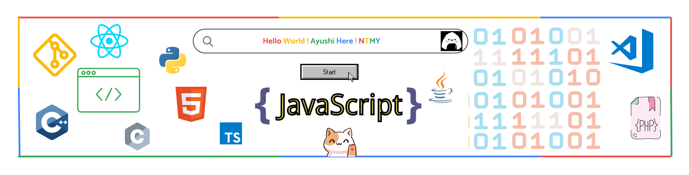
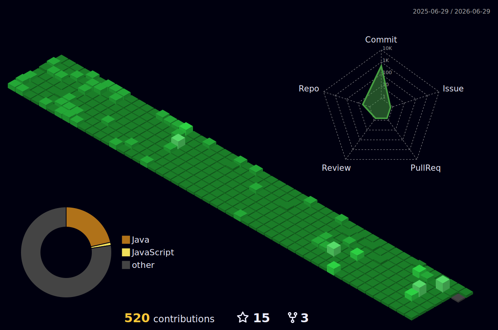

## Hi there

<!-- 
 -->

<!-- 
 -->

 

  

<h3 align="center">Ayushi Srivastava</h3>

  Full-stack and backend-focused developer exploring scalable systems, modern web apps, and cloud-native tooling.

  I enjoy building across the stack, from clean frontend experiences to APIs, databases, infrastructure, and developer workflows.

<h3 align="center">Connect With Me</h3>

  <a href="https://www.instagram.com/ayusureeeee?igsh=OWE0YmZsMHI2OGo0">Instagram</a>
  &nbsp;&nbsp;|&nbsp;&nbsp;
  <a href="https://x.com/ayushirensa">X / Twitter</a>
  &nbsp;&nbsp;|&nbsp;&nbsp;
  <a href="https://github.com/AyushiSrivastava11-github">GitHub</a>
  <!-- &nbsp;&nbsp;|&nbsp;&nbsp;
  <a href="https://example.com/ayushi-srivastava-resume.pdf">Resume</a> -->

<!-- <h3 align="center">GitHub Stats</h3>

  
  &nbsp;&nbsp;
  

 -->

<h3 align="center">Tech Stack</h3>

  Clean, modern tooling across full-stack development, backend systems, cloud, and developer workflow.

<table align="center">
  <tr>
    <td align="center" width="50%">
      <h4>Languages</h4>
      

        
      

      
C • Java • Python • Go • JavaScript • TypeScript • PHP • SQL • NoSQL

    </td>
    <td align="center" width="50%">
      <h4>Frontend</h4>
      

        
      

      
HTML • CSS • React • Next.js • Tailwind CSS • Bootstrap • Vite

    </td>
  </tr>
  <tr>
    <td align="center" width="50%">
      <h4>Backend</h4>
      

        
      

      
Node.js • Express.js • NestJS • Django • Flask • FastAPI • Java • Go • PHP • REST • GraphQL • gRPC

    </td>
    <td align="center" width="50%">
      <h4>Databases</h4>
      

        
      

      
PostgreSQL • MySQL • MongoDB • SQLite • Redis • Oracle Database • DynamoDB • Firebase

    </td>
  </tr>
  <tr>
    <td align="center" width="50%">
      <h4>Tools</h4>
      

        
      

      
Git • GitHub • GitLab • Docker • Kubernetes • Postman • Swagger • npm • pnpm

    </td>
    <td align="center" width="50%">
      <h4>Cloud</h4>
      

        
      

      
AWS • Microsoft Azure • Google Cloud Platform • Firebase • Vercel • Netlify

    </td>
  </tr>
</table>

### Currently Working On

- Building stronger backend and cloud deployment skills
- Exploring scalable APIs, containers, and distributed systems
- Creating projects that combine performance, usability, and clean architecture

### Open To

- Full-stack development opportunities
- Backend engineering work
- Collaboration on practical and interesting projects

  

