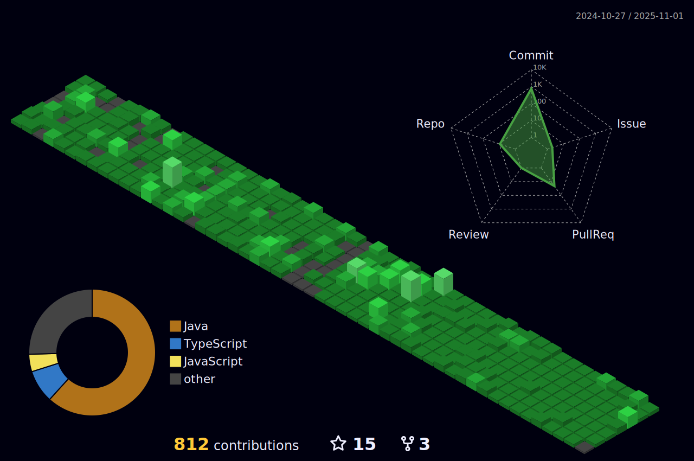

## Hi there 👋

<!-- <h3 align="center">Social Media</h3> -->
<!-- 

    &nbsp;&nbsp;
    &nbsp;&nbsp;
    

 -->

<!-- <h3 align="center">GitHub Trophies</h3>

<h3 align="center">GitHub Stats</h3>

    
    
    
    

    
    &nbsp;&nbsp;
    

<h1 align=center>:open_book: :books: Skilled in :closed_book: :desktop_computer:</h1> -->

<!-- Add your skills here in a similar format -->

<!-- <h1 align=center>Experience</h1> -->

<!-- Add your experience here -->

<!-- <h1 align=center>Volunteering</h1> -->

<!-- Add your volunteering experience here -->

    

